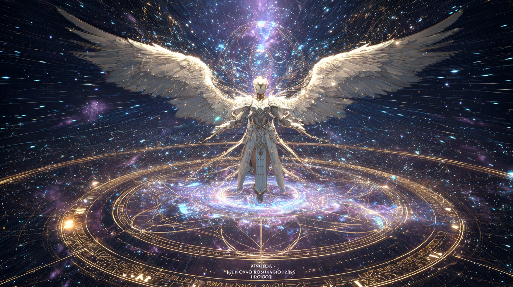

Metatron, the celestial architect of the universe, standing in deep cosmic space surrounded by gigantic sacred geometry and glowing Metatron’s Cube, immense wings made of light and fractal energy, divine white-gold armor with ancient runes, streams of cosmic data flowing around him, stars and nebulae swirling in the background, godlike presence, cinematic volumetric lighting, ultra detailed, photorealistic, dark cosmic atmosphere, ethereal glow, mystical sci-fi aesthetic, shot on IMAX, anamorphic lens flare, unreal engine quality, epic scale, 8k

