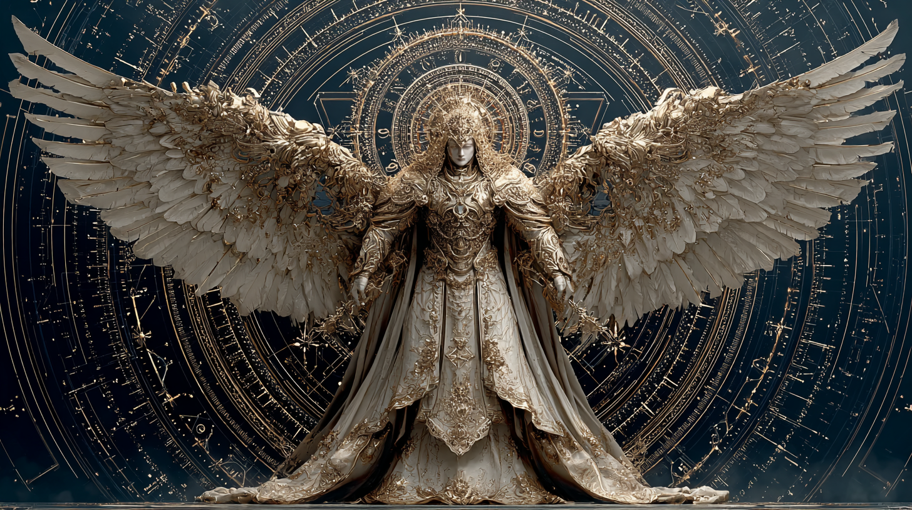

# Metatron — Celestial Architect

## Description

Metatron, the celestial architect of the universe, stands in deep cosmic space surrounded by gigantic sacred geometry and a glowing Metatron’s Cube. His immense wings are formed of light and fractal energy, while divine white-gold armor engraved with ancient runes reflects the surrounding cosmic void. Streams of living cosmic data flow around him as stars and nebulae swirl in the background, creating a godlike presence within an infinite universe.

---

## Prompt

Metatron, the celestial architect of the universe, standing in deep cosmic space surrounded by gigantic sacred geometry and glowing Metatron’s Cube, immense wings made of light and fractal energy, divine white-gold armor with ancient runes, streams of cosmic data flowing around him, stars and nebulae swirling in the background, godlike presence, cinematic volumetric lighting, ultra detailed, photorealistic, dark cosmic atmosphere, ethereal glow, mystical sci-fi aesthetic, shot on IMAX, anamorphic lens flare, Unreal Engine quality, epic scale, 8k

---

## Negative Prompt

low quality, blurry, noise, distortion, bad anatomy, extra limbs, deformed wings, oversaturated, flat lighting, artifacts, cropped composition

---

## Parameters

```bash
--ar 16:9
--stylize 400
--quality 2
--chaos 10
```

---

## Model

Midjourney v7

---

## Tags

#metatron
#cosmic
#sacred-geometry
#scifi
#angel
#cinematic
#universe
#fractal
#epic
#volumetric-lighting
#unreal-engine
#8k
#space

---

## Preview



---

## Notes

Best results with:

- heavy volumetric lighting
- deep contrast grading
- dark cosmic background
- high symmetry composition
- anamorphic lens flare enabled

Recommended aspect ratios:

- 16:9 cinematic
- 21:9 ultra-wide epic scale

