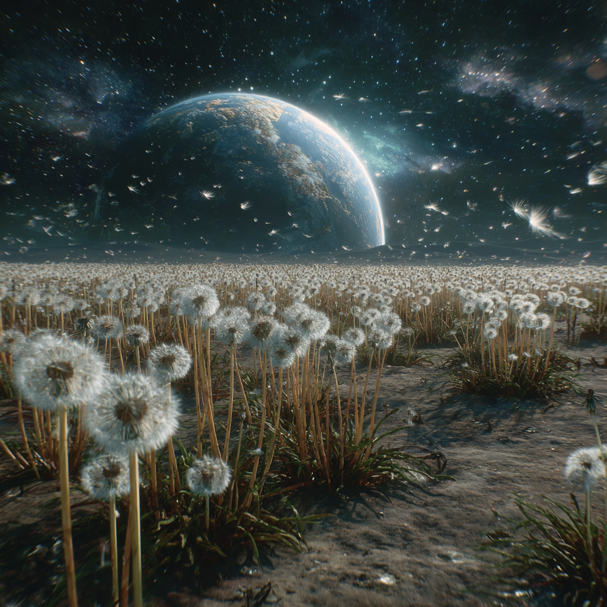

# Dandelion Moon

## Description

A cinematic wide shot of a glowing dandelion field on the Moon with Earth rising in the background.

---

## Prompt

A cinematic wide shot of a vast field of glowing dandelions on the Moon, their delicate white seeds bending and flowing as if moved by an invisible cosmic wind, soft lunar dust drifting through the air, ultra detailed, photorealistic, dramatic volumetric lighting, deep star-filled sky, planet Earth rising on the horizon in the background, shot on IMAX, anamorphic lens flare, atmospheric perspective, dreamlike sci-fi aesthetic, silver-blue color palette, epic scale, highly cinematic composition, 8k

---

## Negative Prompt

low quality, blurry, oversaturated, noisy image, deformed flowers, bad anatomy, low detail, flat lighting, cropped composition, duplicate objects, distorted Earth, artifacts

---

## Parameters

```bash
--ar 16:9
--stylize 350
--quality 2
--chaos 12
```

---

## Model

Midjourney v7

---

## Tags

#moon
#dandelions
#earth
#cinematic
#sci-fi
#space
#photorealistic
#epic
#volumetric-lighting
#imax
#dreamlike
#cosmic
#flowers

---

## Preview



---

## Notes

Works especially well with:
- volumetric lighting
- cinematic upscaling
- silver-blue color grading
- atmospheric fog
- anamorphic lens effects

Recommended aspect ratios:
- 16:9 for cinematic shots
- 21:9 for ultra-wide IMAX compositions
- 4:5 for poster-style framing
