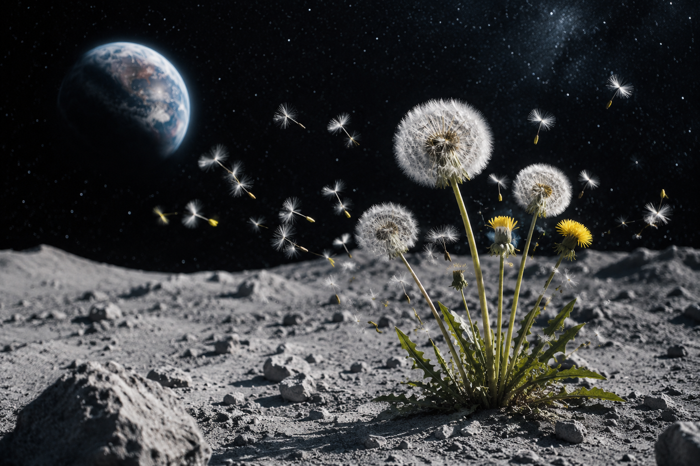

# 🌕 Dandelions on the Moon

## Description
A cinematic shot of a field of dandelions on the Moon, as if the wind were blowing through them, with a starry sky and the planet Earth in the background. The delicate white seeds bend and flow like a silent cosmic breeze passing through the lunar surface. Soft moon dust drifts in low gravity, creating an ethereal, dreamlike atmosphere.

---

## Prompt
A cinematic shot of a field of dandelions on the Moon, as if the wind were blowing through them, with a starry sky and the planet Earth in the background, delicate white seeds bending and flowing, soft lunar dust drifting through the air, ultra detailed, photorealistic, dramatic volumetric lighting, deep star-filled sky, Earth rising on the horizon, shot on IMAX, anamorphic lens flare, atmospheric perspective, dreamlike sci-fi aesthetic, silver-blue color palette, epic scale, highly cinematic composition, 8k

---

## Negative Prompt
low quality, blurry, noise, distortion, oversaturated, flat lighting, artifacts, cropped composition, no astronauts, no spaceships, no text, no watermark

---

## Parameters
- Aspect Ratio: `--ar 16:9`
- Stylize: `--stylize 400`
- Quality: `--quality 2`
- Chaos: `--chaos 15`

---

## Model
GPT - 3.5

---

## Tags
#dandelions #moon #earth #cosmic #scifi #cinematic #ethereal #space #lunar #dreamlike

---

## Preview

---

## Notes

### Best results with:
- Soft volumetric lighting  
- Low lunar gravity effect on seeds  
- Earth as a distant blue planet  
- Silver-blue color palette  
- Anamorphic lens flare  

### Recommended aspect ratios:
- 16:9 cinematic (primary)
- 4:5 for closer composition
